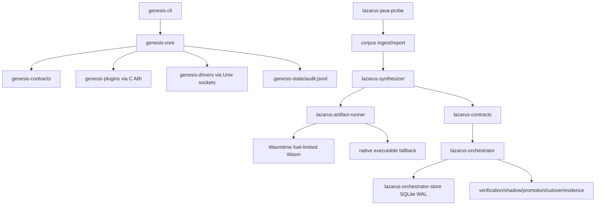

# Project Genesis 架构与源码重构升级报告

审计日期：2026-05-29

## 审计边界

本报告基于当前工作区 `/Users/haypay/Project_Genesis_副本` 可见源码、脚本、文档和本轮已执行验证命令。结论只覆盖当前本机代码状态，不覆盖未提供的生产配置、密钥、线上流量、外部服务可用性和未运行的长期压测。

已验证命令：

- `cargo test --workspace --all-targets`：通过。
- `cargo clippy --workspace --all-targets -- -D warnings`：通过。
- `python3 -m py_compile engine/*.py genesis-daemons/*-python/*.py`：通过。
- `mvn test`：通过，Java Probe 集成测试可启动并关闭 Jetty。
- `mvn clean package`：通过，shaded jar 中 Jackson 已 relocate 到 `com.genesis.lazarus.shadow.jackson`。
- `genesis-cli corpus-ingest` / `genesis-cli corpus-report`：Java Probe 快照 accepted=1, rejected=0, valid=1, methods=1。

当前仓库状态：

- 工作区包含 27 个 Rust workspace members，外加 Java Probe、Python engine/daemons、shell scripts 和 docs。
- `git status --short` 显示大量已修改文件和未跟踪目录，包括 `lazarus-*` 多个 crate、`engine/`、`scripts/`、`docs/`、`.genesis-state/`、`target/` 派生产物。
- 因为工作树不是干净基线，本报告把“可复现性/发布卫生”列为独立风险面。

## 总评分

综合评分：86 / 100。

分项评分：

| 维度 | 分数 | 依据 |
| --- | ---: | --- |
| 架构分层 | 88 | `Cargo.toml` workspace 分层清晰，`genesis-core`、`genesis-contracts`、`lazarus-*` 管线边界明确。 |
| 并发与状态流 | 86 | Action delivery 已用 `Arc<AtomicU8>` + Acquire/Release 建立投递终态；plugin watchdog 有 taint/reap；仍缺长期热重载压力验证。 |
| 验证与证据链 | 90 | Lazarus 状态机、shadow、evidence pack、cutover gate、SQLite transition store 都有测试覆盖。 |
| 安全与隔离 | 76 | Wasm artifact 有 fuel；但 Genesis 插件仍是进程内 FFI，不能等价于强沙箱。native executable runner 只 kill 直接 child。 |
| 可维护性 | 80 | 核心模块有边界，但 `genesis-cli/src/main.rs` 约 972 行，`lazarus-synthesizer/src/lib.rs` 约 1751 行，已出现多职责聚合。 |
| 运维与可复现性 | 72 | 多语言验证已可跑通，但缺单一总验证脚本/CI；工作区存在未忽略运行产物和大量 untracked source。 |
| 测试成熟度 | 84 | Rust/Python/Java 单元和集成测试通过；缺跨进程、长时间、异常恢复、热重载和本地 LM 成功链路的稳定门禁。 |

质量定级：

- 当前状态：可运行但脆弱。
- 工程成熟度：工程化代码，接近生产试点，但未到高可靠发布态。
- 一句话结论：核心状态机和验证链已经成型，最大短板是“进程内 FFI/原生执行隔离”和“发布可复现闭环”还没有达到终极形态。
- 主要风险面：隔离边界、可复现性、异常路径、生命周期、模块耦合、运维门禁。

## 架构拓扑



## 优势清单

1. Workspace 分层清晰。
   - 证据：根 `Cargo.toml` 声明了 `genesis-core`、`genesis-cli`、`genesis-contracts`、`lazarus-contracts`、`lazarus-orchestrator`、`lazarus-synthesizer`、`lazarus-artifact-runner`、`genesis-drivers/*`、`genesis-plugins/*` 等成员。
   - 价值：核心内核、契约、迁移流水线、驱动和插件不是混在一个包里，后续拆 CI、拆发布目标、拆安全边界的成本可控。

2. Action delivery 的并发状态已从“时间猜测”升级为“终态证据”。
   - 证据：`genesis-core/src/act.rs` 使用 `Arc<AtomicU8>` 保存 `PendingAction.delivery_status`；worker 在执行后 `store(..., Ordering::Release)`；verifier 侧 `load(Ordering::Acquire)`；`take_pending_for_verification` 只取 `queued_tick_id < current_tick_id` 且 delivery terminal 的 action。
   - 价值：消费者不会过早收割仍在队列中的 action，降低幻读、早验、状态漂移风险。

3. Actuator IPC 已有 fail-fast 物理上限。
   - 证据：`ACTUATOR_CONNECT_TIMEOUT` 和 `ACTUATOR_WRITE_TIMEOUT` 均为 10ms，外部 actuator 不可用时会产生 `FailureObserved` 并走 fallback。
   - 价值：单个 socket 不会无限拖死主状态机。

4. Plugin watchdog 已补齐关键生命周期动作。
   - 证据：`genesis-core/src/watchdog.rs` 保存 `JoinHandle`，`try_reap()` 只 join 已完成线程；`TrySendError::Full` 和 `Disconnected` 都调用插件 `free_response` 释放响应 buffer。
   - 价值：减少热重载过程中阻塞 join 和 FFI response 泄漏风险。

5. Kernel 已避免同 tick 多 action 派发。
   - 证据：`genesis-core/src/kernel.rs` 在 action dispatch 后设置 `allow_action_dispatch = false`，并在 verification evidence 中附加 delivery evidence。
   - 价值：降低 planner cursor 和 actuator outcome 的一对多错配风险。

6. Lazarus 主状态机有明确的有向转换和终态约束。
   - 证据：`lazarus-orchestrator/src/lib.rs` 的 `next_state` 对 terminal states 和 transition order 做显式拒绝；测试覆盖非法跳转。
   - 价值：迁移流水线不依赖隐式状态字段，错误事件能被拒绝。

7. SQLite store 具备事务化 transition ledger。
   - 证据：`lazarus-orchestrator-store/src/lib.rs` 使用 SQLite WAL、foreign keys，`apply_event` 在 transaction 中更新 job 并写 transition hash。
   - 价值：状态和证据更新是原子提交，便于恢复和审计。

8. Artifact runner 已优先具备 Wasm 安全执行路径。
   - 证据：`lazarus-artifact-runner/src/lib.rs` 使用 Wasmtime `consume_fuel(true)`，执行前校验 fuel > 0，并支持 `wasm32-wasip1` 编译。
   - 价值：相比 native executable，Wasm 路径有确定 fuel 限制和更小系统访问面。

9. Local LM 接入路径已不绑定单一云 API。
   - 证据：`lazarus-synthesizer/src/lib.rs` 支持 `LAZARUS_ORACLE_PROTOCOL=openai_responses|openai_chat|ollama_generate`，本地 chat endpoint 默认 `127.0.0.1:1234/v1/chat/completions`，Ollama 默认 `127.0.0.1:11434/api/generate`；API key 为空时不强制 bearer auth。
   - 价值：可以用 LM Studio/Ollama 做本机 smoke，不需要先接入云端密钥。

10. Java Probe 进入可执行验证状态。
    - 证据：`lazarus-java-probe/pom.xml` 使用 `maven.compiler.release=8`，maven test/package 通过，shade plugin relocate Jackson，生成 probe snapshot 并可被 corpus ingest/report 接受。
    - 价值：首个真实 JVM 采样入口已接入迁移语料链路。

## 弱点清单

1. FFI 插件隔离边界被 README 表述放大。
   - 证据：README 声称 `genesis-core` 负责“内存安全沙箱”；实际 `genesis-core/src/kernel.rs` 通过 `libloading`/C ABI 进程内加载插件，并使用 `unsafe from_raw_parts` 解码插件返回 slice。
   - 风险：进程内 FFI 无法阻止恶意或 UB 插件破坏宿主进程内存。watchdog 能捕获 panic/timeout，但不能提供强内存隔离。
   - 判定：P1 结构缺陷，不是当前测试可触发的 P0。

2. Native executable artifact runner 的隔离弱于 Wasm。
   - 证据：`lazarus-artifact-runner/src/lib.rs` 可编译并执行 native executable；timeout 时调用 `child.kill()`，没有进程组 kill、资源限制、临时目录隔离或 syscall/filesystem 限制。
   - 风险：生成物如果 spawn 子进程、写文件或阻塞 I/O，直接 child kill 不能保证清理完整执行树。
   - 判定：P1 安全/生命周期缺陷；Wasm 路径已较强，应把 native 降级为开发辅助路径。

3. 发布可复现性不足。
   - 证据：当前 `git status --short` 有大量 modified/untracked，包括源码 crate、docs、scripts、`.genesis-state/`、`target/` 派生产物。
   - 风险：无法精确区分“待提交源码”和“运行生成物”，CI 与本机状态可能不一致。
   - 判定：P1 发布卫生缺陷。

4. CLI 模块耦合偏高。
   - 证据：`genesis-cli/src/main.rs` 约 972 行，承载 corpus、cutover、synthesis smoke、测试 helper 等多类命令。
   - 风险：继续扩展会使参数解析、业务调用、文件 I/O 和测试夹具互相污染，增加回归面。
   - 判定：P1 可维护性缺陷。

5. Synthesizer 单文件职责过多。
   - 证据：`lazarus-synthesizer/src/lib.rs` 约 1751 行，同时包含 prompt 编译、HTTP oracle adapter、并发 limiter、响应解析、安全检查、编译反馈、测试夹具。
   - 风险：协议扩展、prompt 模板和 artifact 安全策略会互相牵连，局部修改测试面过大。
   - 判定：P1 可维护性缺陷。

6. Audit logger 有 bounded channel 和 dropped 记录，但缺文件级治理。
   - 证据：`genesis-core/src/audit.rs` 写 `.genesis-state/audit.jsonl`，队列满时累加 `AuditDropped`；未观察到 rotation、fsync 策略、磁盘满处理、启动时路径配置。
   - 风险：长时间运行后 audit 文件无限增长；磁盘满或文件异常时审计线程可能退出或丢失事件。
   - 判定：P1 运维缺陷。

7. 运行时配置分散。
   - 证据：actuator socket env、local LM env、oracle env、snapshot/output 路径分别散落在 Rust 模块、shell 脚本和 docs。
   - 风险：生产环境容易出现“脚本能跑、服务不能跑”或“本地默认覆盖生产配置”的漂移。
   - 判定：P1 运维配置缺陷。

8. 长期并发/热重载压力门禁不足。
   - 证据：单元和集成测试通过，但未观察到统一脚本运行 hot reload storm、actuator socket timeout、watchdog taint/reap、audit backpressure、shadow queue backlog 的组合压力测试。
   - 风险：当前修复解决了已知并发状态漏洞，但缺持续证明。
   - 判定：P1 测试覆盖缺口。

9. Java Probe 依赖需要独立安全扫描。
   - 证据：`pom.xml` 使用 Jackson、Jetty、JUnit、Maven shade；本轮只验证 build/test/package 和 relocation，没有执行 CVE/license 扫描。
   - 风险：JVM 依赖漏洞不会被 Rust clippy/test 覆盖。
   - 判定：P2，但进入生产前必须门禁化。

10. README 架构约束与当前 Lazarus 扩展现实不同步。
    - 证据：README 主要描述 Genesis 微核和插件法则，但当前仓库已包含 Lazarus scanner/orchestrator/verifier/synthesizer/shadow/cutover/evidence 等迁移系统。
    - 风险：新贡献者会按旧 mental model 修改代码，导致架构边界误解。
    - 判定：P2 文档一致性问题。

## P0 致命缺陷

未观测到 P0 级致命缺陷。

说明：

- 当前 Rust workspace tests/clippy、Python py_compile、Java Maven test/package 均通过。
- 已知历史风险点中，Action delivery 早验、watchdog response buffer 泄漏、retired worker 阻塞 join、多 action 同 tick 派发等路径，在当前代码中已有针对性修复。
- 未做线上长时间压测，因此不能承诺不存在隐藏 P0；只能说在当前源码和已执行验证范围内未观测到。

## P1 结构缺陷

### P1-1：进程内 FFI 被表述为强沙箱

- 位置：README 的“内存安全沙箱”表述；`genesis-core/src/kernel.rs` 的动态库加载和 FFI slice 解码。
- 问题本质：隔离语义不清。
- 长期后果：团队可能误把 panic/timeout watchdog 当成恶意插件防护边界。
- 重构方向：二选一。保留当前性能路径时，文档改成“trusted in-process plugin boundary”；如要接收不可信插件，迁移到进程外 worker 或 Wasm plugin runtime。
- 是否需要立即修改：是，至少先修正文档和威胁模型。

最小修复方向：

```text
README: 将“内存安全沙箱”改为“进程内 FFI 插件边界 + watchdog taint/timeout”。
新增 docs/security-boundary.md：明确 trusted plugin、untrusted plugin、native artifact、Wasm artifact 的不同隔离级别。
```

复杂度影响：无运行时复杂度变化；只改变文档和安全边界声明。

### P1-2：Native artifact 执行树清理不足

- 位置：`lazarus-artifact-runner/src/lib.rs` native executable timeout 路径。
- 问题本质：生命周期结束后只 kill 直接 child。
- 长期后果：生成物若产生子进程或外部资源，timeout 后可能残留。
- 重构方向：把 production path 默认切到 Wasm；native path 增加 process group/session、temp workdir、resource limits，并在超时时 kill process group。
- 是否需要立即修改：是，进入生产 pilot 前必须处理。

最小修复方向：

```text
1. CLI/配置中将 native executable runner 标为 dev-only。
2. production synthesis/cutover 只接受 WasmArtifact。
3. macOS/Linux 分别实现 process group kill；无法实现时拒绝 native runner production mode。
```

复杂度影响：Wasm 默认路径无额外复杂度；native cleanup 增加常数级系统调用，不改变算法复杂度。

### P1-3：工作树污染导致验证不可复现

- 位置：仓库根目录状态。
- 问题本质：源码、运行产物、缓存和文档混杂在 untracked/modified 状态。
- 长期后果：无法建立可信发布基线；别人 checkout 后不一定能复现本机通过状态。
- 重构方向：补 `.gitignore`，清理 `.genesis-state/`、`target/`、`__pycache__/`、临时 report；把应提交的 crate/docs/scripts 明确纳入版本控制。
- 是否需要立即修改：是。

复杂度影响：无运行时复杂度变化；提升构建可复现性。

### P1-4：CLI 单文件多职责

- 位置：`genesis-cli/src/main.rs`。
- 问题本质：命令路由、文件 I/O、业务 orchestration、测试夹具耦合。
- 长期后果：新增命令容易破坏旧命令，测试定位困难。
- 重构方向：保持 CLI 外部接口不变，把命令实现拆到 `commands/corpus.rs`、`commands/synthesis.rs`、`commands/cutover.rs`、`commands/replay.rs`，`main.rs` 只保留 parser 和 dispatch。
- 是否需要立即修改：否，但应作为下一轮维护性升级。

复杂度影响：无算法复杂度变化；编译单元增多但可维护性提升。

### P1-5：Synthesizer 单文件过大

- 位置：`lazarus-synthesizer/src/lib.rs`。
- 问题本质：HTTP 协议、prompt、候选提取、安全校验、编译反馈和测试夹具耦合。
- 长期后果：新增 Anthropic/Gemini/本地模型协议或 prompt 模板时，回归面覆盖整个 synthesis 内核。
- 重构方向：拆为 `oracle.rs`、`prompt.rs`、`safety.rs`、`compile_feedback.rs`、`local_models.rs`，保持 public API 不变。
- 是否需要立即修改：否，但在继续扩协议前先拆。

复杂度影响：无运行时复杂度变化；模块边界更清晰。

### P1-6：Audit 文件治理不足

- 位置：`genesis-core/src/audit.rs`。
- 问题本质：审计通道有 backpressure 记录，但文件存储没有 rotation/容量策略。
- 长期后果：长跑后磁盘占用不可控；磁盘异常时审计可靠性不明确。
- 重构方向：增加 `GENESIS_AUDIT_PATH`、`GENESIS_AUDIT_MAX_BYTES`、rotation；错误写入 stderr 并暴露 health counter。
- 是否需要立即修改：生产前需要。

复杂度影响：每条审计写入增加常数级 size 检查；热路径影响可控。

## P2 优化建议

### P2-1：统一总验证脚本

- 位置：`scripts/`。
- 问题：已有 `validate_lazarus_engine.sh`、`validate_lazarus_java_probe.sh`、local LM smoke 脚本，但缺“一键全量门禁”。
- 建议：新增 `scripts/validate_all.sh`，串联 Rust test/clippy、Python compile、Java test/package、corpus ingest/report，可选 local LM smoke。
- 收益：降低人工漏跑概率，CI 可直接复用。

### P2-2：README 更新为双系统架构说明

- 位置：`README.md`。
- 问题：当前 README 仍以 Genesis 微核为中心，Lazarus 迁移系统已成为同级主线。
- 建议：新增 Genesis runtime 与 Lazarus migration pipeline 两张拓扑图，并标注信任边界。
- 收益：减少贡献者误读。

### P2-3：Java 依赖安全门禁

- 位置：`lazarus-java-probe/pom.xml`。
- 问题：构建通过不等价于依赖安全。
- 建议：增加 Maven OWASP dependency-check 或等效 CVE 扫描；把 shade relocation 检查脚本化。
- 收益：生产 pilot 前发现 JVM dependency 风险。

### P2-4：本地 LM smoke 需要成功样本固化

- 位置：`docs/lazarus-local-lm-smoke.md`、`scripts/run_lazarus_local_lm_synthesis_smoke.sh`。
- 问题：脚本已能连接本地 OpenAI-compatible server，但文档记录大模型因本机内存 guardrail 未完成成功 smoke。
- 建议：固定一个小模型成功样本，保存 oracle request/response 和 `synthesis-smoke-report.json`。
- 收益：证明端到端 synthesis 网络/解析/编译链路。

## 边界压力测试结论

| 压力项 | 当前结论 |
| --- | --- |
| null 输入 | Rust 类型系统覆盖内部路径；外部 JSON/FFI slice 已有部分校验。FFI pointer/len 仍依赖插件契约。 |
| 空集合 / 空字符串 | `GenesisAction::Wait` selector、`ClickPoint.target_id` 有校验；artifact payload missing input 会返回错误。 |
| 非法索引 | 多数生产代码用 Result；测试代码大量 `unwrap` 不计入生产缺陷。生成 artifact 的 args 长度有检查。 |
| 重复调用 | Orchestrator 拒绝非法状态跳转；Action pending ledger 支持多 action id。仍需 hot reload storm 压测。 |
| 外部 API 失败 | actuator socket fail-fast；oracle HTTP 有 timeout/retry/status 分类；Java probe build/test 已通过。 |
| 异常是否被吞噬 | audit dropped 会计数；watchdog timeout 会 taint。部分 logger 只 stderr 输出，缺统一 health surface。 |
| 资源是否可靠释放 | watchdog 对 dropped FFI response 已释放；native timeout 只 kill direct child，进程树清理不足。 |
| 并发或异步状态漂移 | Action delivery 使用 atomic terminal state 修复主要漂移；shadow queue 使用 atomic counters，仍需长跑验证。 |
| 生命周期结束后调用 | retired plugin 有 nonblocking reap；native child timeout 后仍缺 process group 级生命周期闭环。 |
| 大数据量输入 | prompt 有 max chars；audit 文件无 rotation；shadow ledger summarize 读全文件，超大 ledger 会有内存/延迟压力。 |

## 复杂度扫描

- 当前主要算法复杂度：
  - Action pending verification：每 tick 扫描 pending queue，O(n) 时间，O(n) retained 空间；n 为未验证 action 数。
  - Shadow ledger summarize：O(lines) 时间，当前实现读全文件，空间 O(file_size)。
  - SQLite transition load/count：依赖索引，单 job transition 查询可控。
  - Wasm module cache：按 artifact path/hash BTreeMap，lookup O(log n)，n 为缓存模块数。
- 重复遍历：
  - pending queue verification 会每 tick 遍历未 terminal actions；当前规模下可接受，极端 actuator 卡住时需要 pending 上限/TTL。
  - shadow ledger summarize 读全量文件，生产大 ledger 应改 streaming reader。
- 无意义对象分配：
  - Synthesizer prompt/response 多次 String/Value 转换属于协议层常数开销；不是当前热路径瓶颈。
- 隐藏 I/O 或阻塞调用：
  - audit worker 写文件、actuator Unix socket、oracle HTTP、native rustc/child process、Maven/Java probe 均是外部 I/O；已有部分 timeout，但 audit 文件和 rustc compile 是明确阻塞路径。
- 热路径性能风险：
  - 主要在 audit 无 rotation、pending queue 无 TTL、shadow ledger 全文件 summarize、大 prompt 编译和本地 LM 网络调用。
- 是否需要优化：
  - 生产前优化 audit/ledger 文件治理和 native runner 隔离；Action atomic 路径无需进一步加锁。

## 精准重构与升级路线

### Phase 0：冻结可复现基线

目标：让“本机通过”变成“任何机器可复现通过”。

任务：

1. 新增 `scripts/validate_all.sh`。
2. 更新 `.gitignore`：忽略 `.genesis-state/`、`genesis-core/.genesis-state/`、`target/`、`__pycache__/`、临时 local LM report。
3. 明确应提交源码目录：`lazarus-*`、`engine/`、`scripts/`、`docs/`。
4. 增加 CI：Rust test/clippy、Python compile、Maven test/package、corpus ingest/report。

通过标准：

- 干净 checkout 后单命令通过。
- CI 结果与本机结果一致。

### Phase 1：修正隔离边界声明

目标：消除“进程内 FFI = 安全沙箱”的语义风险。

任务：

1. README 改写安全边界。
2. 新增 `docs/security-boundary.md`。
3. 把插件分成 trusted in-process、untrusted out-of-process、Wasm artifact 三类。
4. 在加载 untrusted plugin 时拒绝进程内 FFI 或强制外部 worker/Wasm。

通过标准：

- 文档和代码默认行为一致。
- 任何不可信生成物默认走 Wasm，不走 native/FFI。

### Phase 2：Artifact runner 生产硬化

目标：让生成物执行路径达到可上线隔离级别。

任务：

1. Production mode 只允许 Wasm artifact。
2. Native runner 增加 dev-only 标记和显式 opt-in。
3. Native timeout 改为 process group/session kill。
4. 增加临时工作目录清理和资源限制。
5. 增加测试：timeout child spawn、stderr/stdout 大输出、非法 payload、fuel exhaustion。

通过标准：

- Wasm 路径 fuel exhaustion 可稳定返回 trapped。
- Native runner 无法在 production mode 被误调用。

### Phase 3：CLI 和 Synthesizer 拆模块

目标：降低后续协议扩展和命令扩展回归面。

任务：

1. `genesis-cli/src/main.rs` 保留 parser/dispatch。
2. 新增 `genesis-cli/src/commands/{corpus,synthesis,cutover,replay}.rs`。
3. `lazarus-synthesizer` 拆为 `oracle`、`prompt`、`safety`、`compile_feedback`、`local_models`。
4. 保持 public API 和 CLI 参数兼容。

通过标准：

- 拆分前后 `cargo test --workspace --all-targets` 结果一致。
- 关键命令 golden output 不变。

### Phase 4：审计与长跑门禁

目标：证明系统能长时间稳定运行。

任务：

1. Audit rotation 和容量上限。
2. Shadow ledger streaming summarize。
3. Hot reload storm 测试。
4. Actuator socket timeout/backpressure 测试。
5. Watchdog taint/reap 压测。
6. Pending action TTL 或容量上限报警。

通过标准：

- 长跑测试不泄漏线程、文件描述符、子进程。
- audit dropped、queue dropped、plugin tainted 都有可观测计数。

### Phase 5：本地模型实弹闭环

目标：让 Java Probe 快照驱动 Synthesizer 生成第一份可验证 Wasm。

任务：

1. 固定一个本机可跑小模型。
2. 执行 `scripts/run_lazarus_local_lm_synthesis_smoke.sh`。
3. 保存 oracle request/response log。
4. 生成 `synthesis-smoke-report.json`。
5. 把成功样本纳入非默认 CI 或 nightly smoke。

通过标准：

- 本地 LM 返回 Rust source。
- source 通过 safety extraction。
- Wasm 编译通过。
- verification/shadow/cutover gate 至少跑通 smoke 级闭环。

## 最小修复优先级

1. 先修：
   - 建立 `scripts/validate_all.sh` 和 CI。
   - 清理/忽略运行产物，恢复可复现工作树。
   - 修正 README 中 FFI 隔离边界表述。
   - Production mode 禁用 native executable runner 或强制 Wasm。

2. 再修：
   - Native runner process group kill 和 resource limits。
   - Audit rotation/health counter。
   - Hot reload/watchdog/action/audit 压测。
   - Java dependency CVE 扫描。

3. 可暂缓：
   - CLI 和 Synthesizer 拆模块。
   - README 拓扑图美化。
   - 更多 provider 协议接入。

## 目标满分形态

满分不是“没有任何风险”，而是每个风险都有明确边界、门禁和恢复路径。

100 分目标应满足：

1. 干净 checkout 后 `scripts/validate_all.sh` 一次通过。
2. CI 覆盖 Rust、Python、Java、corpus、Wasm runner、Java probe packaging。
3. 不可信代码只走 Wasm 或进程外 sandbox。
4. Native runner 默认关闭，仅 dev opt-in。
5. FFI plugin 明确为 trusted in-process plugin。
6. Audit/ledger 有 rotation、容量上限和健康指标。
7. Hot reload、actuator failure、oracle failure、shadow backlog、plugin panic 都有压力测试。
8. 本地 LM smoke 有成功样本和可回放日志。
9. 所有 runtime env 进入统一 config schema。
10. 工作树干净，运行产物不污染源码审查。

## 最终判定

1. 当前项目可以运行，且核心状态机、验证链、Java Probe 和多语言测试已通过，但还不能按“高可靠生产系统”定级。
2. 最大风险不是算法错误，而是隔离边界和发布可复现性：进程内 FFI/native runner 不能被包装成强沙箱，脏工作树也不能支撑可信发布。
3. 最小升级路径是先冻结验证基线和安全边界，再把生产执行路径收敛到 Wasm，最后拆 CLI/Synthesizer 并补长跑门禁。
